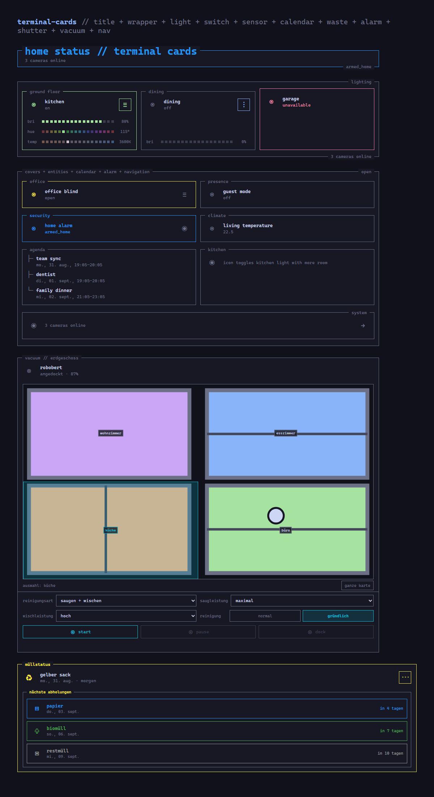

# Terminal Cards

Terminal-style Lovelace cards for Home Assistant, inspired by Herdr panes: square 1 px borders, monospace labels embedded in the top border, and theme-aware state colors. Entity, Light, Waste, Alarm, Shutter, and Navigation Cards automatically reduce their horizontal content spacing from 14 px to 10 px below 261 px card width so mobile labels retain more room.



## Cards

### `custom:terminal-card-wrapper`

Frames arbitrary Lovelace child cards with a terminal-style title embedded in its top border. Child cards have matching 18 px top and bottom spacing. They are vertical by default; set `columns` for a grid. Children in the same grid row stretch to an equal height. When the final grid row contains only one card, that card automatically spans the complete row. An optional formatted entity state or reactive template result can be embedded in any of the four frame corners. The native-style visual editor can add, configure, reorder, and remove child cards without YAML; it lazily loads Home Assistant's native card picker when necessary instead of requiring the editor to be reopened.

```yaml
type: custom:terminal-card-wrapper
title: kitchen
title_position: right
accent_color: blue
entity: sensor.kitchen_temperature
state_template: "{{ states(config.entity) }} °C"
state_position: bottom-right
columns: 2
cards:
  - type: tile
    entity: light.kitchen
  - type: tile
    entity: sensor.kitchen_temperature
```

### `custom:terminal-title-card`

A compact terminal heading frame for dashboard sections. Its large title remains embedded slightly inside the upper border and can be positioned left or right. Font size is configurable from 14 to 48 px. An optional `subtitle` accepts Markdown and reactive Home Assistant templates in the same field; rendered template output is passed to Home Assistant's Markdown component. With a left-aligned title, the subtitle uses the same text inset and sits compactly with equal vertical space between the title and lower border. Right-aligned titles retain the centered subtitle layout. Like the Wrapper, TitleCard can embed a formatted entity state or reactive template result in any frame corner without overlapping its title. When an entity is configured, that border state becomes an accessible popup button; `state_tap_action` defaults to the terminal `more-info` popup.

```yaml
type: custom:terminal-title-card
title: home status
subtitle: "**power:** {{ states('sensor.house_power') }} W"
entity: alarm_control_panel.home
state_position: bottom-right
state_tap_action:
  action: more-info
popup_title: security
font_size: 28
title_position: left
accent_color: blue
```

### `custom:terminal-light-card`

A compact light card with terminal state colors and responsive square controls for brightness, hue, and color temperature when the selected light supports them. The square three-dot button expands or collapses those controls. Its name always remains inside the card; an independent optional `border_title` can additionally label the surrounding room or group.

```yaml
type: custom:terminal-light-card
entity: light.kitchen
name: ceiling light
icon: mdi:ceiling-light
off_icon: mdi:lightbulb-off-outline
border_title: office
show_state: true
show_brightness: true
show_hue: true
show_color_temp: true
use_light_color: true
accent_color: blue
more_icon: mdi:tune-variant
popup_title: light-details
show_controls: true
controls_expanded: false
tap_action:
  action: toggle
hold_action:
  action: more-info
```

All options are available through Home Assistant-native visual form controls. The entity selector only offers `light.*` entities; action fields use Home Assistant's native action editor. The number of square segments adapts automatically to the rendered card width. Temperature runs from warm/low Kelvin on the left to cold/high Kelvin on the right. With `use_light_color`, the active RGB/HS color or color temperature drives the icon, border, controls icon, brightness segments, and popup accent.

### `custom:terminal-switch-card`

A compact card for `switch.*` and `input_boolean.*` entities. Tap toggles the entity by default; hold opens the terminal popup. Both actions can be replaced through Home Assistant's native action editor.

```yaml
type: custom:terminal-switch-card
entity: input_boolean.guest_mode
name: guest mode
icon: mdi:account-check
off_icon: mdi:account-off
border_title: presence
show_state: true
accent_color: green
popup_title: switch-details
tap_action:
  action: toggle
hold_action:
  action: more-info
```

### `custom:terminal-sensor-card`

A read-focused card for `sensor.*` and `binary_sensor.*` entities. It displays Home Assistant's formatted state, accents active binary sensors, and opens the terminal popup on tap by default. Native actions remain configurable for dashboards that need a sensor shortcut.

```yaml
type: custom:terminal-sensor-card
entity: sensor.living_room_temperature
name: living temperature
icon: mdi:thermometer
border_title: living room
show_state: true
accent_color: cyan
tap_action:
  action: more-info
```

### `custom:terminal-calendar-card`

A compact agenda for one `calendar.*` entity. It shows the next three events by default and subscribes to Home Assistant's live calendar event API. Each tree entry presents its description first, followed by the localized date and time; an optional location remains on the final line. The visual editor can change the event count from 1 to 10, search between 1 and 365 days ahead (30 by default), and optionally show event locations. Timed events show their start and end times, with both dates for overnight events; all-day events remain clearly labelled. Events are sorted chronologically and rendered safely as text.

```yaml
type: custom:terminal-calendar-card
entity: calendar.family
title: upcoming
max_events: 3
days_to_show: 30
show_location: false
title_position: left
accent_color: cyan
```

### `custom:terminal-waste-card`

A compact waste status backed by one `calendar.*` entity. Its 72 px main row shows the nearest collection as a semantic 34 px icon, lower-case waste name, localized date, and relative countdown. A separate square button expands up to four full-width Terminal list tiles beginning with the following collection, so the main collection is never repeated. Every semantic waste type appears only once across the complete card; when the calendar contains multiple collections for the same bin, the earliest one wins and later types backfill the list. `max_entries` controls this additional list. Each tile carries its own waste icon, name, date, countdown, and type-specific border color. `controls_expanded` sets the initial state, while `always_expanded` keeps the list visible and hides the button. Colors and icons for plastic/yellow bag, paper, organic, residual, glass, and other waste all use native Home Assistant editor selectors.

```yaml
type: custom:terminal-waste-card
entity: calendar.nickelsdorf
title: müllstatus
tiles_title: nächste abholungen
max_entries: 4
days_to_show: 90
controls_expanded: false
always_expanded: false
more_icon: mdi:dots-horizontal
plastic_color: yellow
paper_color: blue
bio_color: green
residual_color: grey
glass_color: cyan
other_color: purple
plastic_icon: mdi:recycle
paper_icon: mdi:newspaper-variant-outline
bio_icon: mdi:leaf
residual_icon: mdi:trash-can-outline
glass_icon: mdi:bottle-soda-classic-outline
other_icon: mdi:delete-outline
```

The card recognizes German and common English waste labels. Its manual expansion state survives normal Home Assistant refreshes, calendar updates remain lifecycle-guarded, and all event content is rendered through `textContent`. Missing, unknown, or unavailable calendar entities and subscription errors retain the fixed Error color. Configurations created with the temporary v0.15 type `custom:terminal-waste-status-card` remain functional through a hidden compatibility alias, but new cards should use `custom:terminal-waste-card`.

### `custom:terminal-alarm-card`

A compact control for one `alarm_control_panel.*` entity. Tapping Icon/Name/State opens the complete terminal popup; the independent square controls button expands supported arm modes and Disarm directly inside the card. Home, Away, Night, Vacation, and Custom are derived exclusively from `supported_features`. When the entity requires a code and has no entity-registry `default_code`, the expanded card uses a masked session-only PIN/code field. Codes are cleared after success, reconnect, config change, collapse, or disconnect; errors remain visible for a retry. Manual alarm triggering is intentionally never exposed. Disarmed, Home, Away, Night, Vacation, Custom Bypass, Arming, Pending, Disarming, and Triggered each have their own native HA theme-color option. An explicit state color takes precedence, existing `accent_color` remains the backward-compatible fallback, and the semantic defaults apply when neither is configured. The current state's color drives the card border, border title, icon, state, focus/hover, active control, and terminal popup.

```yaml
type: custom:terminal-alarm-card
entity: alarm_control_panel.home
name: security system
border_title: security
show_state: true
show_controls: true
controls_expanded: false
accent_color: red
more_icon: mdi:shield-key-outline
popup_title: security
disarmed_color: grey
home_color: blue
away_color: orange
night_color: purple
vacation_color: cyan
custom_bypass_color: pink
arming_color: yellow
pending_color: deep-orange
disarming_color: yellow
triggered_color: red
tap_action:
  action: more-info
```

### `custom:terminal-shutter-card`

A capability-aware control for `cover.*` entities. The square controls button reveals only the functions supported by the selected shutter or blind: open, stop, close, position, and tilt position.

```yaml
type: custom:terminal-shutter-card
entity: cover.office_blind
name: office blind
icon: mdi:blinds-horizontal
off_icon: mdi:blinds
border_title: office
show_state: true
show_controls: true
show_position: true
show_tilt: true
accent_color: yellow
more_icon: mdi:menu
popup_title: cover-details
controls_expanded: false
hold_action:
  action: more-info
```

### `custom:terminal-vacuum-card`

A full-width terminal control for one `vacuum.*` entity. Its live `image.*` map is also the room selector: compatible map entities exposing `rooms` and `calibration_points` receive accessible clickable overlays, while Home Assistant's native Vacuum segment-to-area mapping resolves every map segment to an `area_id`. With selected rooms, Start calls `vacuum.clean_area`; without a selection it starts a complete clean. Pause, Resume, and Dock use the native Vacuum actions.

Suction power is read dynamically from the vacuum's `fan_speed_list`. Optional `select.*` entities add cleaning type, mop intensity, and Normal/Thorough controls. For Roborock, Thorough maps to the native `deep` mop path; it does not run the complete cleaning twice. Missing or ambiguous area mappings never fall back to vendor commands: the map remains visible, selection is disabled, and the card explains that segments must first be assigned to Home Assistant areas in the Vacuum entity settings.

```yaml
type: custom:terminal-vacuum-card
entity: vacuum.roborock_qrevo_curv_series
map_entity: image.roborock_qrevo_curv_series_erdgeschoss_custom
cleaning_mode_entity: select.gastezimmer_robobert_reinigungsmodus
mop_mode_entity: select.roborock_qrevo_curv_series_mopp_modus
mop_intensity_entity: select.roborock_qrevo_curv_series_wisch_intensitat
battery_entity: sensor.roborock_qrevo_curv_series_batterie
name: robobert
border_title: cleaning
title_position: left
normal_mode: standard
thorough_mode: deep
accent_color: cyan
```

All public options use native Home Assistant visual-editor controls. The Vacuum and map entities are required; mode and battery entities are optional, so unsupported groups simply stay hidden. The map adapter validates its affine calibration, clips room rectangles to the image, keeps room targets at least 34×34 px, cache-busts stable image URLs when the Image entity publishes a new state, preserves room selection across normal state refreshes, renders all labels through `textContent`, and blocks stale image, registry, or service results after reconnects and configuration changes.

### `custom:terminal-navigation-card`

An internal Home Assistant navigation card. The native Name placement selector keeps the name inside the card or uses it as the border title; border-title mode leaves only the secondary content inside. The trailing navigation icon can be hidden to reclaim its complete layout width, and the remaining icon gap is compact so long labels and paths have more room. The visual editor uses Home Assistant's native navigation-path picker. The optional state `entity` can also power a separate `icon_tap_action`: clicking the main icon runs a native Home Assistant action or service while clicking the remaining card still navigates.

```yaml
type: custom:terminal-navigation-card
name: kitchen
navigation_path: /dashboard-test/kitchen
icon: mdi:lightbulb
off_icon: mdi:lightbulb-off-outline
variant: pane # uses the name as border title
title_position: right
accent_color: cyan
show_navigation_icon: false # gives secondary content more room
more_icon: mdi:arrow-right-bold # used when the icon is visible
entity: light.kitchen
state_template: "{{ states(config.entity) | upper }}"
icon_tap_action:
  action: toggle
show_path: true
```

## Appearance and terminal popup

Every card uses Home Assistant's native theme-color palette for `accent_color` (for example `blue`, `green`, `purple`, or `cyan`) instead of an RGB color picker. The selected theme token controls the active border, icons, hover/focus state, and controls, and follows theme overrides such as `--blue-color`. Existing RGB-array configurations remain render-compatible but are no longer offered by the visual editor. The design intentionally has no box-shadow glow. Light state color takes precedence when `use_light_color: true`.

Every card with a border title supports `title_position: left|right`. Wrapper and TitleCard border state support `state_position: top-left|top-right|bottom-left|bottom-right`; labels sharing a corner shrink without overlapping. Light, Switch, Sensor, Alarm, Shutter, Vacuum, and continuous Navigation Cards support an optional independent `border_title` without moving or replacing the internal entity name. Their domain-aware `off_icon` is used for `off`, and for `closed` covers. Every visible icon receives the same square hover border, including Navigation's trailing icon. Entity icons remain vertically centered against their name/state stack.

A `more-info` action opens the bundle's own terminal-style entity popup instead of Home Assistant's native dialog. On desktop, its borderless terminal-background shell uses the former 14 px top padding equally on all four sides. Its TitleCard-style border title defaults to `more-info` and can be changed with `popup_title`. The card name or entity friendly name is shown separately above the formatted state. On mobile the popup becomes a near-full-width bottom sheet with an 8 px gap on both sides. The layer order is standard `--card-background-color` outer area → 1 px accent border → card surface. The outer area measures 12 vh above and below the popup (or the larger device safe area), protecting rounded phone corners; title/header stay fixed and only the content scrolls. Capability-aware Light and Cover ranges use the same responsive square segments as the cards. For `alarm_control_panel.*`, the terminal popup derives Home/Away/Night/Vacation/Custom modes from `supported_features`, offers Disarm when applicable, and uses a masked numeric/text code field only when the entity requires one. Alarm trigger is intentionally never exposed; PIN values are kept only for the active popup session and cleared after success, reconnect, or close.

The collapsed `logs` field loads on demand and displays up to six entity changes from Home Assistant's last 24 hours of Logbook data. When expanded, the complete terminal tree is enclosed by its own square Wrapper-style frame with `logs` embedded on the left and the dropdown icon fixed on the right. Service-backed entries place `domain.service · on|off` on their second line. While open, selected-entity changes trigger a debounced live Logbook refresh. The popup also supports pointer and keyboard holds, traps focus, closes with Escape/backdrop/close, and returns focus to the card.

Navigation secondary content uses this precedence: a successful reactive `state_template` result, then free-text `label`, then the formatted `entity` state, then the navigation path when `show_path` is enabled. Wrapper and TitleCard border state use template result, then formatted entity state. Title subtitles combine Markdown with reactive templates. All templates use Home Assistant's `render_template` WebSocket subscription with generation guards and unsubscribe cleanup.

## Installation with HACS

1. Open HACS → **Custom repositories**.
2. Add `https://github.com/agrestisdavid/terminal-cards` as category **Dashboard**.
3. Install **Terminal Cards**.
4. Hard-refresh Home Assistant (`Ctrl+Shift+R`).

HACS loads the release asset `terminal-cards.js`; no inline `data:` resource is needed. All eleven cards appear in Home Assistant's card picker and provide graphical configuration.

## Development

```bash
npm install
npm test
```

The production bundle is written to `dist/terminal-cards.js`.

## Theme variables

The bundle uses Home Assistant theme variables with Herdr/Catppuccin Mocha fallbacks:

- `--card-background-color`
- `--primary-text-color`
- `--secondary-text-color`
- `--accent-color`
- Home Assistant palette variables selected through `accent_color`, such as `--blue-color`, `--green-color`, and `--purple-color`
- `--error-color`

## License

MIT
